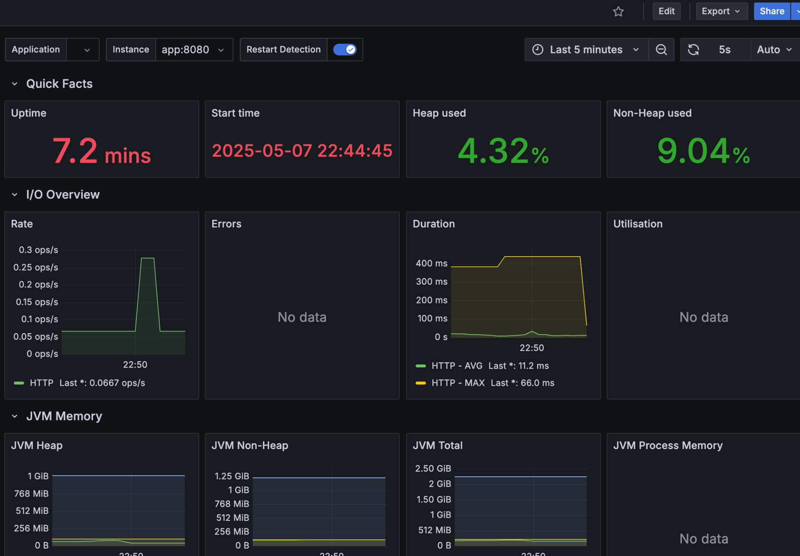

# 📦 Subscription Service (Spring Boot + PostgreSQL + Docker)

Микросервис для управления пользователями и их подписками на цифровые сервисы (Netflix, Яндекс.Плюс и др).

## Технологии

- Java 17
- Spring Boot 3 (Web, Data JPA, Validation, Cache)
- PostgreSQL
- Hibernate
- Docker + Docker Compose
- Swagger (SpringDoc OpenAPI)
- SLF4J (логирование)
- JUnit + MockMvc (тесты контроллеров)
- Grafana + Prometheus
---

## ✅ Реализовано

### Пользователи (`/api/v1/users`)
- `POST /` — создание пользователя
- `GET /{id}` — получить пользователя
- `PUT /{id}` — обновить пользователя
- `DELETE /{id}` — удалить пользователя

### Подписки (`/api/v1/users/{userId}/subscriptions`)
- `POST /` — добавить подписку
- `GET /` — получить все подписки пользователя
- `DELETE /{subId}` — удалить подписку

### ТОП подписок
- `GET /api/v1/subscriptions/top` — получить топ-3 популярных подписок

---

## Кэширование

Используется встроенное кеширование Spring (`@EnableCaching`) 

Для кэша используется `ConcurrentMapCacheManager` (можно заменить на Redis при необходимости).

---

## Обработка ошибок

- Глобальный `@RestControllerAdvice` с логированием ошибок
- Обработка:
    - `@Valid` валидации
    - `EntityNotFoundException`
    - других `RuntimeException`

---

## Тесты

- Контроллеры покрыты `@WebMvcTest`
- Проверяется корректность HTTP-ответов, тела, статусов и валидации

---

## 🗂 Логирование

- Все действия логируются через `SLF4J` (уровни: info, debug, warn, error)
- Поддержка логов в консоль и файл (logback)

---

## ⚙️ Docker 
Для быстрого развертывания
- `Dockerfile` и `docker-compose.yml` 
        
---
## CI/CD
#### Проект использует GitHub Actions для автоматической сборки, тестирования и деплоя Docker-образа.

Что делает workflow:
Запускается при пуше в `main` или `master`.

Поднимает PostgreSQL в CI-среде.

Собирает проект и запускает JUnit-тесты (`mvn clean verify`).

Собирает Docker-образ и пушит его в `Docker Hub`.

Файл workflow:
`.github/workflows/docker.yml`

Требуется:
Добавить в GitHub Secrets:

`DOCKER_USERNAME` — логин Docker Hub

`DOCKER_PASSWORD` — токен или пароль от Docker Hub

---

## 📊 Метрики и мониторинг
####   В проекте подключён Spring Boot Actuator и поддержка Prometheus + Grafana:

##### Микросервис предоставляет метрики в формате Prometheus по адресу:
    `http://localhost:8081/actuator/prometheus`

### Grafana
Подключи Prometheus как источник данных в Grafana.

Импортируй готовый JVM Dashboard (например, ID 4701) или создай собственный



---
## В будущем можно добавить

- **JWT-аутентификацию**
    - Авторизация через `Authorization: Bearer <token>`
    - Роли пользователей (USER / ADMIN)
    - Ограничение доступа к эндпоинтам

- **Rate Limiting** (ограничение частоты запросов)

- **Кеш в Redis** вместо встроенного

- **OpenTelemetry / Tracing**

- **API Key защита** для внутренних микросервисов

---

## Локальный запуск проекта
## Требования:
Java 17+

Maven 3.8+

Docker и Docker Compose

✅ Шаги запуска:
1. Клонируй репозиторий
```basch
   git clone https://github.com/IlyaDi1305/subscription-service
   cd subscription-service
```

После клонирования, перейди в папку проекта и выполни команду:
```basch 
    mvn clean package
```
2. Запусти базу данных и приложение
```basch
   docker-compose up --build
```
### Это поднимет:

#### PostgreSQL и Spring Boot приложение 

3. Проверь, что всё работает
   Открой браузер и перейди на:

```basch
http://localhost:8081/swagger-ui/index.html#/
```

#### Ты увидишь Swagger-интерфейс с документацией и возможностью тестировать API.

4. Пример запроса на создание пользователя (через curl):

```basch
   curl -X POST http://localhost:8081/api/v1/users \
   -H "Content-Type: application/json" \
   -d '{"name": "Иван", "email": "ivan@example.com"}'
```
5. Для остановки:
```basch
    docker-compose down
```

---

## 📖 Swagger UI

После запуска доступен по адресу:
http://localhost:8081/swagger-ui/index.html#/

##  Быстрый тест через Swagger

1. Открой Swagger UI
2. Нажми на `POST /api/v1/users` → Try it out
3. Создай пользователя:
```json
{
  "name": "Иван",
  "email": "ivan@example.com"
}
```
4. Используй id из ответа в /users/{id}/subscriptions
